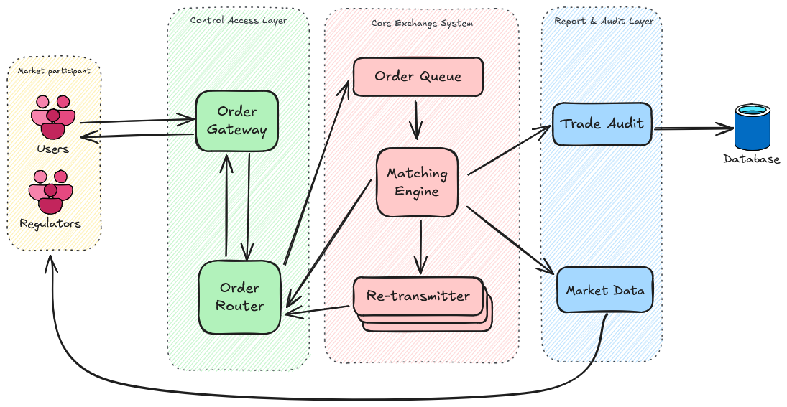
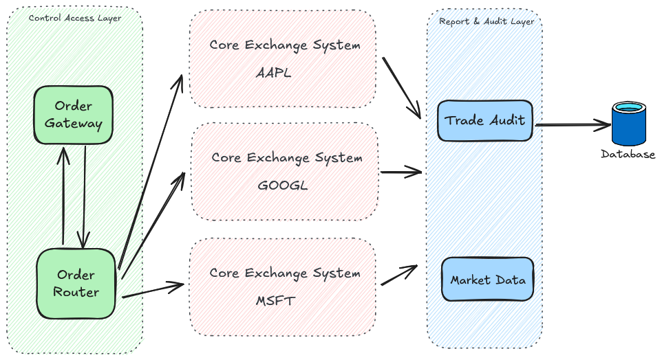
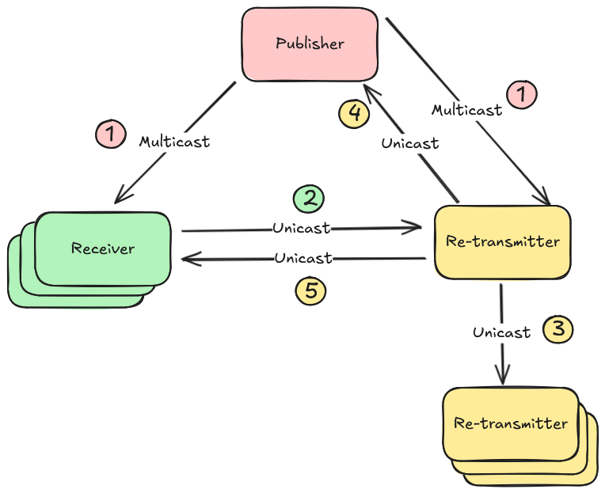
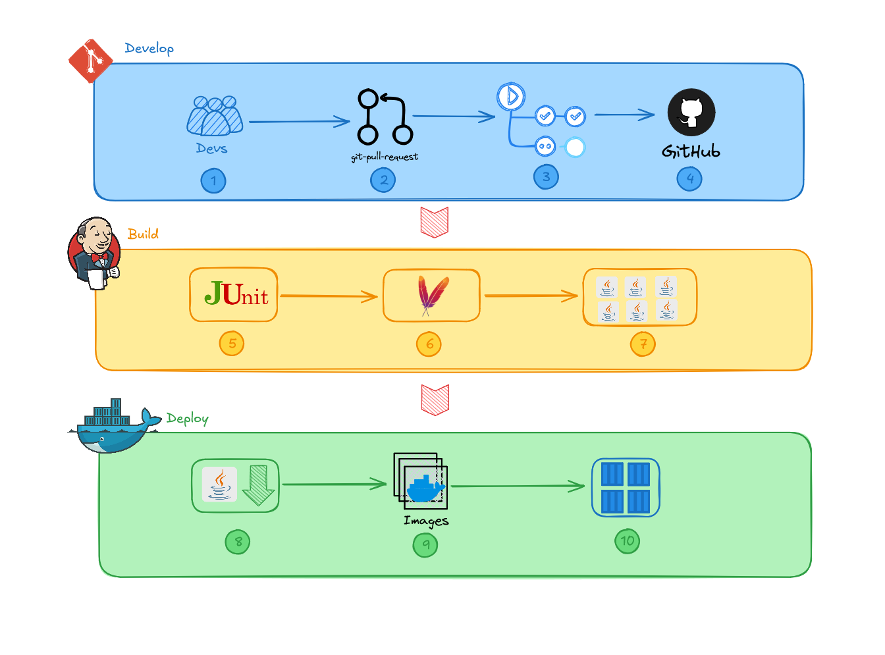
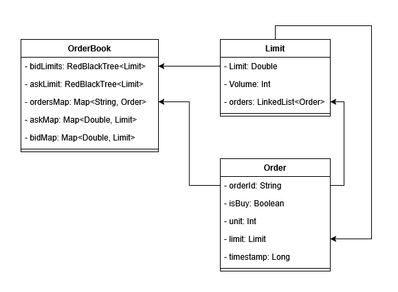
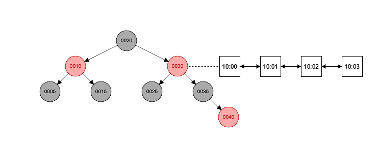

# Stock Exchange System

You can access the Front-end repository [here](https://github.com/Jiruu246/ExchangeUI) 

## Techstack
### Frontend

     ReactJS

### Backend

     Java | 
     Spring Boot

### DevOps

     Jenkins | 
     Docker

### Testing

     JUnit

# Core Trading Platform Architecture

## **System Overview**

This trading platform delivers a high-performance, secure environment for market participants to place, modify, and execute trades with enterprise-grade reliability. The system architecture prioritizes transaction speed, data integrity, and security while maintaining a scalable infrastructure that can adapt to market volatility and user growth.

## **Core Functionality**

### **Order Book Management**
The heart of the trading engine incorporates an order book implementation with the following characteristics:

- **Optimized Order Operations**: All core order operations (placement, modification, cancellation) are executed with O(1) time complexity, ensuring consistent performance regardless of order book depth.
- **Comprehensive Order Types**:

    - Limit orders with explicit price specifications
    - Market orders executed at best available price
- **Efficient Matching Algorithm**: Matching engine pairs compatible buy and sell orders based on price-time priority, executing transactions automatically when price conditions are satisfied.
- **Order State Management**: State transitions between pending, active, partially filled, filled, and cancelled states with atomic operations.

### **User Authentication System**
A comprehensive account management system that provides:

- User Authentication
- Transaction Ledger: record of user activities
    - Trade execution details
    - Order history with state transitions
    - Account balance modifications
    - Audit events for compliance purposes

### **Market Data Subsystem**
Real-time and historical market data processing capabilities:

- **Price Discovery Visualization**:
    - OHLC (Open, High, Low, Close) charting with configurable time intervals

- **Depth of Market Analysis**:
    - Volume profiles at different price levels

### **Disaster recovery**

- Point-in-time recovery capabilities
- Hot standby systems for immediate failover

# Micro-service architecture (high-level)

The system architecture adopts a hybrid approach, combining a layered architecture with microservices to maximize modularity, separation of concerns, and operational resilience. This design enables independent scaling of components, facilitates continuous deployment, and provides fault isolation while maintaining a coherent system structure. Each layer contains purpose-specific microservices that collaborate to fulfill the system's responsibilities.

### Market Participants Layer
This outermost conceptual layer represents the diverse ecosystem of users interacting with the trading platform:

- **Trading Firms**: Entities executing proprietary trading strategies
- **Brokerage Services**: Intermediaries executing orders on behalf of clients
- **Market Makers**: Liquidity providers maintaining continuous buy/sell quotes
- **Clearing Firms**: Post-trade processors handling settlement and clearing
- **Regulatory Bodies**: Oversight entities monitoring market activity
- **Individual Traders**: End users accessing the platform directly

These participants interact with the system through standardized protocols, either submitting transaction requests or consuming real-time data feeds. Each participant type has distinct access patterns, permissions, and service-level requirements.

### Access Control Layer
This boundary layer serves as the controlled entry point for all external communications, implementing:

1. **API Gateway Service**: This service provides unified entry point for all external requests. It handles initial message validation and malformed request rejection. Implements protocol translation between external formats and internal message formats, enforces rate limiting and traffic shaping based on client service tiers

2. **Load Balancer**: It distributes incoming traffic across available service instances, it implements advanced routing algorithms (round-robin, least connections, weighted response time). It also performs health checks on downstream services and provides traffic analytics for capacity planning

3. **Authentication Service**: This service validates user credentials and issues session tokens and implements multi-factor authentication workflows. It manages API key lifecycle and permissions. It integrates with enterprise identity providers via SAML/OAuth

4. **Order Gateway**: This service performs deep validation of order parameters and enforces trading limits and risk checks. It enriches orders with user-specific attributes and generates unique order identifiers and timestamps

5. **Order Router**: Determines appropriate destination matching engine based on instrument type and identifier

### Core Exchange System
This critical layer contains the high-performance components that execute the primary business logic:
Key Components:
1. **Order Queue Service**: This service implements durable message queues with guaranteed delivery. It ensures strict FIFO processing for fairness and provides backpressure mechanisms during volume spikes. It also maintains sequence numbers for order processing integrity

2. **Matching Engine**: This service implements a deterministic state machine for order processing, it maintains in-memory order books for assigned instruments and executes matching algorithms based on price-time priority. It generates execution reports and trade confirmations. It also implements circuit breakers and volatility interruptions

3. **Retransmission Service**: This service handles message replay requests for missed or corrupted messages. It maintains a short-term cache of recently processed messages. It also implements negative acknowledgment (NACK) processing to provide sequence gap detection and recovery

### Report & Audit Layer
This layer captures, processes, and distributes system activity data for compliance, analysis, and dissemination:
Key Components:
1. **Trade Audit Service**: This service captures comprehensive trade execution details and maintains tamper-evident audit trails using hash chains. It also provides time-sequenced reconstruction of market events and generates regulatory compliance reports. It implements long-term storage of transaction history

2. **Market Data Service**: This service aggregates and processes raw transaction data including constructing OHLC (Open, High, Low, Close) price candles, calculating volume profiles across price levels and disseminating market data feeds with minimal latency. It implements data compression for efficient transmission

3. **Analytics Engine**: It processes historical data for pattern recognition and calculates derived market metrics (volatility, liquidity indicators). It also detects anomalous trading patterns and generates scheduled and on-demand reports

# Scaling the system
This trading platform employs advanced scaling strategies to ensure performance, reliability, and fault tolerance as trading volume and symbol coverage expands. The architecture is specifically designed for horizontal scalability while maintaining the strict ordering and consistency requirements. The partitioning strategy divides processing workload based on security identifiers

Rather than processing all instruments through a single matching engine, the system distributes order matching across multiple dedicated engine instances, with each responsible for a specific symbol or a subset of symbols. This approach reduce complexity by simplifying state management and reducing memory requirements. It also optimise performance and facilitates indipendent scaling. 

## Horizontal Scaling Strategy

**Access Control Layer Scaling**: We can scale horizontally to accommodate increasing user connection counts. It implements stateless design to facilitate rapid instance addition and uses consistent hashing for load distribution when adding or removing instances. It maintains client affinity where beneficial for performance

**Order Router Scaling**: It expands routing capacity as symbol coverage increases. It updates routing tables dynamically as matching engines are added. It also implements intelligent load distribution algorithms and provides redundant routing paths for critical symbols

**Matching Engine Cluster Expansion**: It adds new matching engine instances for additional symbol coverage and redistributes symbols across instances to balance load. It supports hot addition of new engines without system downtime and implements graduated symbol migration to minimize disruption

**Data Storage and Reporting Scaling**: It implements data partitioning strategies aligned with matching engine organization. It also utilizes tiered storage approaches for different data access patterns and scales report generation capacity independently from transaction processing. Additionally, it also employs read replicas to support analytical workloads

## Fault tolerance

All critical services are implemented as deterministic state machines: Given identical input sequences, replicas will arrive at identical states. Current state can be reconstructed by replaying the event sequence. Performance critical service such as the matching engine can maintaining replicas and remain synchronized through event stream processing. Standby replicas can immediately assume primary role upon failure detection and connection redirection happens transparently to clients. The Re-transmitter service plays a crucial role in fault tolerance. It captures and durably stores all messages flowing through the system, it maintains ordering guarantees essential for state reconstruction.

# Networking design

## Communication Protocol

The trading system requires ultra-low latency and high throughput processing of market transactions, making traditional TCP connections unsuitable due to handshake latency and connection management overhead. Instead, UDP multicast has been selected as the optimal transport mechanism, implementing a publisher-subscriber pattern that ensures all market participants receive critical updates simultaneously with strict fairness, preventing informational advantages.

Though UDP multicast provides superior performance characteristics, it introduces reliability challenges that must be addressed. Unlike TCP, UDP offers no inherent guarantee of message delivery or ordering. To overcome these limitations without sacrificing performance, I implemented Re-transmitter services to fix the reliability issues. It works as follow:
- All messages are deliberately kept below the network's Maximum Transmission Unit (MTU) size, avoiding fragmentation to force the communication to use this custom protocol's message ordering.
- Each message published by the publisher carries a unique increasing sequence number.
- The Re-transmitter service maintains a cache of recently published messages.
- Any service detects missing messages by the sequence, it requests specific retransmissions from the Re-transmitter rather than the original publisher.

The Re-transmitter employs a tiered recovery strategy where missing messages are first retrieved from local cache, then from other Re-transmitter instances if needed, and finally directly from the original publisher's memory as a last resort.

- Step 1: Publisher broadcasts data via UDP multicast to all subscriber (receivers + Re-transmitter).
- Step 2: When a receiver identifies sequence discontinuity (e.g., receiving message #101 after #99), it initiates recovery by generating a Negative Acknowledgement (NACK) for the missing message (#100) and transmitting the NACK via UDP unicast to designated retransmitters
- Step 3: Retransmitters maintain sequence integrity through regular UDP-based cache synchronization and proactive missing message acquisition from peer retransmitters
- Step 4: If no retransmitter possesses the requested message, the request escalates to the original publisher.
- Step 5: The first retransmitter acquiring the missing message delivers it via UDP unicast directly to the requesting receiver.

Note: In the event that all recovery mechanisms fail to retrieve a missing message, the receiver will declare a network issue. For implementation simplicity, the system will terminate the affected receiver instance. Alternatively, the receiver can be flagged as an unhealthy instance, allowing for investigation of the underlying connectivity problems.

Details of the implementation can be found [here](./docs/communication_protocol.md)

## Message sequencing in details
The trading system implements a dual-layered sequence numbering scheme to maintain event ordering across all components. 

### **Global Sequence Number**

Aassigned by the Matching Engine during acknowledgment broadcasts, provide centrallised ordering across the entire platform. This numbering enables gap detection during recovery, allows retransmitters to track missing messages, and ensures passive Matching Engine instances process messages in identical order as the primary.

### **Topic-Based Sequence Numbers**

operate within specific message categories, with each topic maintaining an independent sequence stream. This partitioning enables conflict detection and resolution when multiple parties modify shared state. For clients, these sequence numbers ensure consistent observation of their own messages relative to others in the same topic. This number stream enables the ability to detect missing message in the above communication architecture, each receiver will manage their own topics to reduce the complexity.

# CI/CD Pipeline

The pipeline is divided into three main workflows: Development, Build and Deployment.

1. Developers work on new features or bug fixes in their local environments.
2. Upon completion, developers create a pull request on GitHub
3. Pull request triggers GitHub Actions which:
    - Runs automated tests
    - Formats code
    - Executes linting scripts

4. After passing all checks, code changes are merged into the main branch

This triggers the Build pipeline managed by Jenkins

5. Jenkins checks out the code base and runs test using JUnit
6. After successfully running test, it triggers the build process using Maven
7. Jenkins archives the artifacts (.jar, .war)

Repeat all the steps for any new feature/bug fix requests.
When it is time for a new release the Deploy pipele will be run

8. Jenkins downloads artifacts from the last successful build
9. Docker Compose builds container images based on the artifacts
10.  Containers are deployed to production environment

Repeat the cycle for the next release

# Matching Engine (low-level design)

## Order Book design
The order book is the core component of our exchange, designed for high-efficiency order storage, retrieval, and matching. It operates entirely in-memory to ensure low latency performance. The bid and ask limits are stored in separate red-black trees ordered by price. Along with Lookup Maps for fast retrieval

**OrderBook**
- bidLimts/askLimit: Bid and ask limits are stored in separate red-black trees ordered by price
- askMap/bidMap: Price-to-limit maps for quick limit access
- orderMap: Order ID map for direct order retrieval

**Limit**
- Limit: Represents orders at a specific price point
- Volume: Tracks total quantity at this price
- orders: Time-ordered linked list of orders at this price

**Order**
- Properties: ID, buy/sell flag, quantity, timestamp
- Limit: Direct reference to parent limit object

## Time Complexity of critical operations
The following table describe the time complexity of all critical operation of a matching engine including add new order, cancel existing order, execute order when matched, get volume at arbitrary limit and get best bid/ask

| Operation      | Time Complexity                           |
| -------------- | ----------------------------------------- |
| Add            | O(1) most case, O(log m) for new limit    |
| Cancel/Remove  | O(1) most case, O(log m) for remove limit |
| Get best offer | O(1)                                      |
| Execute        | O(1)                                      |
| Get volume     | O(1)                                      |

Where m is the number of Limit

**Add**: Adding a new order typically completes in O(1) time when the price limit already exists. This common scenario only requires a hash table lookup followed by appending to a linked list. In less frequent cases where a new price limit needs creation, the operation costs O(log m) as it requires insertion into the red-black tree, where m represents the total number of distinct price limits.

**Cancel/Remove**: Order cancellation generally executes in O(1) time by leveraging the order ID lookup table for direct access. When removing the final order at a specific price point, additional O(log m) work occurs to remove the entire limit from the red-black tree, though this scenario is less common.

**Get best offer**: The enhanced red-black tree implementation maintains pointers to the minimum and maximum nodes, enabling immediate access to the best bid or ask. Combined with head pointers in the order linked lists, retrieving the best offer consistently performs in O(1) time.

**Execute**: The matching execution combines retrieving and removing the best matching orders, both O(1) operations, resulting in an overall O(1) time complexity for trade execution.

**GetVolume**: Volume queries at any price level complete in O(1) time, as each limit object maintains a running volume count that updates with every order modification.

