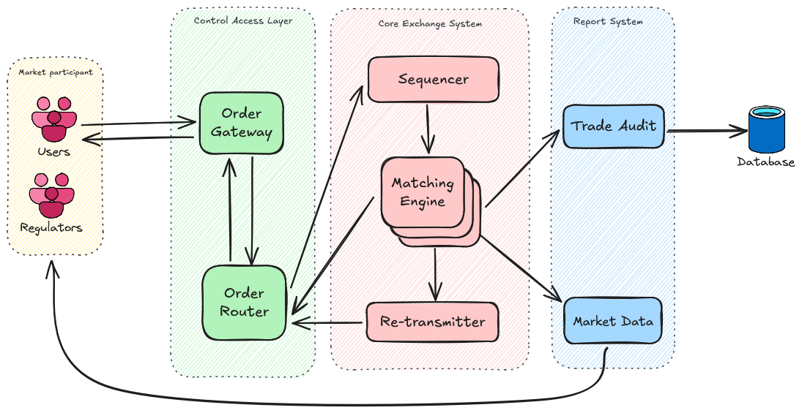

A simple trading platform

Front-end: https://github.com/Jiruu246/ExchangeUI

# Requirements
## Core Functionality

### Order Book Management

1. Maintain buy and sell orders sorted by price and time
2. Support limit orders (specify price) and market orders (at best available price)
3. Match buy and sell orders automatically when price conditions are met

### User Account System

1. User registration and authentication
2. Account balances (cash and securities)
3. Transaction history

### Trading Functionality

1. Place/modify/cancel orders
2. View current market prices
3. Execute trades when matching orders exist
4. Calculate and apply trading fees

### Settlement System

1. Record completed transactions
2. Update account balances after trades
3. Generate trade confirmations

### Market Data

1. Historical price charts
2. Volume information
3. Basic technical indicators

## Technical Requirements

### Performance

1. Process order matches with minimal latency
2. Handle concurrent order submissions

### Data Storage

1. Persistent storage for orders, trades, and account information
2. Backup and recovery mechanisms

### Security

1. Secure user authentication
2. Data encryption for sensitive information
3. Audit logs for system activities

# System Design

# Networking design

- Step 1: Publisher sends data messages via UDP multicast
- Step 2: Receiver gets message #101 after previously receiving #99. Receiver detects missing message #100. Receiver creates a NACK (Negative Acknowledgement) message and send via UDP unicast to a pre-configured list of re-transmitters
- Step 3 (Can be parallel): Re-transmitters communicate with each other via UDP to sync their caches. If one re-transmitter notices it's missing a message in its sequence, it can request from other re-transmitters
- Step 4: If none of the re-transmitter has the message, fall back to requesting from original source
- Step 5: First re-transmitter with the message responds. Re-transmitter sends the missing message via UDP unicast directly to the requesting receiver

Note: If all resort failed to receive the missing message, the receiver will marked as having issue and the instance will be terminate for the simplicity of the implementation.

## Message size control
Messages are kept below the MTU (Maximum Transmission Unit) size to avoid fragmentation entirely. Messages are typically compact and structured to fit within a single UDP datagram (usually under 1500 bytes).

## Global sequence number
Applied to every message in the system
Assigned by the Matching Engine when broadcasting messages
Used for:

Ensuring total ordering across the entire system
Gap detection during recovery
Allowing retransmitters to track missing messages

This is what ensures the passive Matching Engine processes messages in the exact same order as the primary

## Topic-Based Sequence Numbers

Separate sequence number streams for each topic (typically each port/participant)
Used for:

Transaction synchronization (the "locking" mechanism)
Detecting and resolving conflicts when multiple ports try to modify the same state
Ensuring clients see their own messages in a consistent order